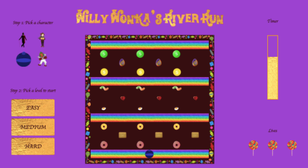

# General Assembly Project 1: Willy Wonka's River Run


## Table of Contents
- [Overview](#overview)
- [Technologies used](#technologies-used)
- [Build](#build)
- [Known bugs](#known-bugs)
- [Wins](#wins)
- [Challenges](#challenges)
- [Future features](#future-features)
- [Key learnings](#key-learnings)

<a name="overview"></a>
## Overview
Willy Wonka’s River Run was my first project created during General Assembly’s Software Engineering Immersive Course, which I completed from September-December 2021.

<strong>The goal:</strong> as a solo project, build a grid-based browser game using HTML, CSS and Vanilla JavaScript.

The game I created is called Willy Wonka’s River Run and is based on the game Frogger, which was initially conceived by Konami video game developer Akira Hashimoto in 1981. Using the logic from Frogger, however, adapting it slightly, the objective of my game is for the player to use the arrow keys to move a character across Willy Wonker’s chocolate river. They do this by jumping on moving treats and landing on rainbow belts. At the beginning of the game, the player has the option to pick both a character and a level. The game has to be completed within a certain amount of time and each player has 3 lives. 



### Timeframe
8 days

### Deployed link
https://taliaglantz.github.io/SEI-Project-1/ 

### Getting started
1. Either clone or download the source code.
2. Open the index.html file in your browser.
3. Play!

<a name="technologies-used"></a>
## Technologies used

* HTML5
* CSS3
* JavaScript

<a name="build"></a>
## Build

Key dates:
* Day 1: Planning
* Day 6: MVP
* Day 7: Bonus tasks
* Day 8: Styling

### Day 1: Planning
#### See notes.js
I was incredibly excited, however also unbearably nervous, about starting this project after all the amazing examples we had seen from previous students. This was the first time in the course that I had that gut-wrenching imposter syndrome feeling in the pit of my stomach, however I knew that my key to success with this project was going to be impeccable planning, and I knew I was good at that! 

I started my planning with clear pseudocode that I further detailed with how I was going to achieve that game objective. In my planning I also included bonus tasks and theme ideas. I then moved onto my wireframe which I did using the trusty pencil and paper method. Finally, to manage my time, I set daily achievable tasks that I crossed off as they were completed. 

### Days 2 and 3

I found it challenging to know where to start with this project regarding the code, and so decided that a good start would be to get the visualisation of the game set-up so that I could see what I was doing when I moved onto the JavaScript and game logic. My weekend was spent setting up the page according to my wireframe and ensuring all elements were where I intended them to be placed. I built out the index.html file, the basic CSS file and used flexbox to mould the page. I set up the 13x13 grid and displayed the treat images inside, and also the character images outside of the grid. By the end of the weekend, I also had a character that could move around the grid using the keys as controls.

```
// Grid

  const grid = document.querySelector('.grid') // get grid element
  const width = 13
  const height = 13
  const cellCount = width * height// total number of cells
  const cells = [] // empty array to store the divs that we create
  
// Character

  let character = 'violet'
  const characterStartPosition = 162
  let characterCurrentPosition = 162
```
### Days 4-6

I was committed to hitting my target of having an MVP by the end of day 6 and I achieved it!
These three days were spent solely on JavaScript, however I also made sure I took breaks from this to work on the styling - firstly as it definitely is a break without being a break, and secondly so that I wasn’t lumped with a whole lot of styling at the end. 

Having started a little on this over the weekend, by the end of day 4 I had all the treats moving on a timer in the correct directions and on repeat, upon the player pressing a “start” button. 

On day 5 I worked on the logic for the character only being able to jump onto the food items, and by default not being able to jump anywhere else  - hence falling in the river and dying (although death by chocolate doesn’t sound too bad…). I also added in the “safe ground” rainbow belts and the ability for the player to start playing the game by clicking on a specific level. This level determines the speed by which the treats move across the river.
```
function startMovementEasy() {
    sweetTreats.forEach(treat => { // iterate through all the food items
      if (treat.order === 'first') { // check if the food item should come first
        treat.treatTimer = setInterval(() => moveFoods(treat), 1000) // set value of treatTimer to be id returned from setInterval and call function to move the food items 
      } else if (treat.order === 'second') {
        setTimeout(() => { // delay start of the second set of food items
          addFood(treat) // add them at their starting positions
          treat.treatTimer = setInterval(() => moveFoods(treat), 1000)
        }, 4000) // determines how long before 2nd food item comes in
      } else if (treat.order === 'third') {
        setTimeout(() => { // delay start of the second set of food items
          addFood(treat) // add them at their starting positions
          treat.treatTimer = setInterval(() => moveFoods(treat), 1000)
        }, 8000) // determines how long before 2nd food item comes in
      }
    })
  }
```

On day 6 I combined the work I had done the previous day on the "falling in the river" logic, with the player lives functions, and also built the game timer. 
```
// Losing lives

  function loseLife() {

    removeCharacter(characterCurrentPosition)
    characterCurrentPosition = characterStartPosition
    addCharacter(characterCurrentPosition)
    lives--
    removeLollipop()
  }

  // Character falling in river

  function characterInRiver() { // boolean function if return + &&/||
    return cells[characterCurrentPosition].getAttribute('id') !== 'rainbow-belt' && cells[characterCurrentPosition].classList.length === 1
  }


  function removeLollipop() {
    if (lives === 2) {
      lollipopOne.style.display = 'none'
    } else if (lives === 1) {
      lollipopTwo.style.display = 'none'
    } else if (lives === 0) {
      lollipopThree.style.display = 'none'
      //alert('Game over')
      losing()

    }
  }
```
I think it is an appropriate point here to admit that I am not a gamer. I played a bit of club penguin and the Sims (building the houses only, obviously) when I was younger, however that was about it. I should also admit that I probably should have done a bit more playing of Frogger before I started building this game. I had a realisation towards the end of day 6 that it would make a lot of sense if the character moved with the treats as they were moving too. I started building this logic towards the evening of day 6. There is a big function called `moveFoods` that manages the movement of the foods however the character-on-treat specific bit is the following:  
```
if (treat.direction === 'right') { //check direction of food item and update position accordingly
      treat.currentPosition++
      if (charactersOnTreat) {
        characterCurrentPosition++
      }
    } else {
      treat.currentPosition--
      if (charactersOnTreat) {
        characterCurrentPosition--
      }
    }
```
Without this (I would argue) minor detail, I still consider my target hit of getting to an MVP by this point.

### Day 7

This minor detail ended up requiring a bit more logic than I had originally thought, however it was completed by the end of the day. I had also managed to work on my bonus task of the player being able to choose a character, which works by grabbing the ids of the characters clicked on. 

```
function chooseCharacter(event) {
    //console.log(event)
    if (preGame) {
      character = event.target.id // character is an id that represents a string
      cells[characterStartPosition].classList.replace('charlie', character)
      cells[characterStartPosition].classList.replace('violet', character)
      cells[characterStartPosition].classList.replace('willy-wonka', character)
      cells[characterStartPosition].classList.replace('oompa-loompa', character)
      console.log(character)
    }
  }
  ```
I then started working on the “winner” and “loser” alert messages, which was built around the logic of using the visibility CSS property.
```
 // Winning and losing screens

  const section = document.querySelector('section')
  const winDiv = document.querySelector('.alert-box-successful')
  const loseDiv = document.querySelector('.alert-box-game-over')

  // Winning screen
  
  function winning() {

    section.classList.add('none')
    winDiv.style.visibility = 'visible'
  }

  // Losing Screen

  function losing() {
    section.classList.add('none')
    loseDiv.style.visibility = 'visible'
  }

```


### Day 8

We had our project presentations at around lunchtime so my morning was mostly spent finalising the styling of the game and ensuring the layout of the code was neat and tidy.


<a name="known-bugs"></a>
## Known bugs
- Some of the treats never line-up so crossing the river at times is genuinely impossible.
- You can’t switch levels whilst playing the game, otherwise the treats move at two speeds at the same time.


<a name="wins"></a>
## Wins
It is very easy to say that a challenge turned into a win, but it’s true! When planning the game, I wanted to try to go that extra mile and <strong>attempt bonus tasks</strong> that would take the game to a new level. I had my heart set on ensuring the player had the ability to choose which character they would like to play and I am so happy this additional feature made it into the game! Generally, I am also so pleased with my <strong>planning</strong>, I broke the tasks down into achievable goals so the overall project felt more manageable and I was therefore able to achieve my desired outcome and overall success.


<a name="challenges"></a>
## Challenges
Specifically in terms of the coding, the most challenging parts of the logic were:
- Getting the treats set up in JS with their orders and directions and in CSS with each character was incredibly tedious. 
- The ability to get the character moving with the object they had landed on.
- The ability for the player to choose a character.
- The “winner” and “loser” alert messages.


<a name="future-features"></a>
## Future features
* Get the treats moving smoothly across the grid, rather than clearly from box to box.
* To have other objects on the moving treats that enable the player to gain lives/gain points.
* Start screen with countdown timer to game and animation to “enter Willy Wonka’s Factory”.


<a name="key-learnings"></a>
## Key learnings
I’m big on processing and wanted to make sure that I had everything down as soon as I finished the project - my notes on this can be found in the notes.js file, however a few key points to expand on:
1. “STOP OVERCOMPLICATING THINGS!!!!!” - I know that for my first project, my goal was to have code that worked rather than ensuring it was the DRY-est and KISS-iest it could possibly be. This project forced me to keep my logic simple and think through the exact steps to be able to achieve the desired functionality, before actually writing it. Essentially, I planned and micro-planned!
2. Force myself to take breaks - I believe that a great strength of mine is that I have a lot of patience, this does however come at fault when I am trying to solve something. This project taught me that it is essential to take breaks and move onto another task if you have been stuck on one for a while. 
3. I knew this already, however this project made me so glad that I know how to: Plan, Plan and Plan Again!
